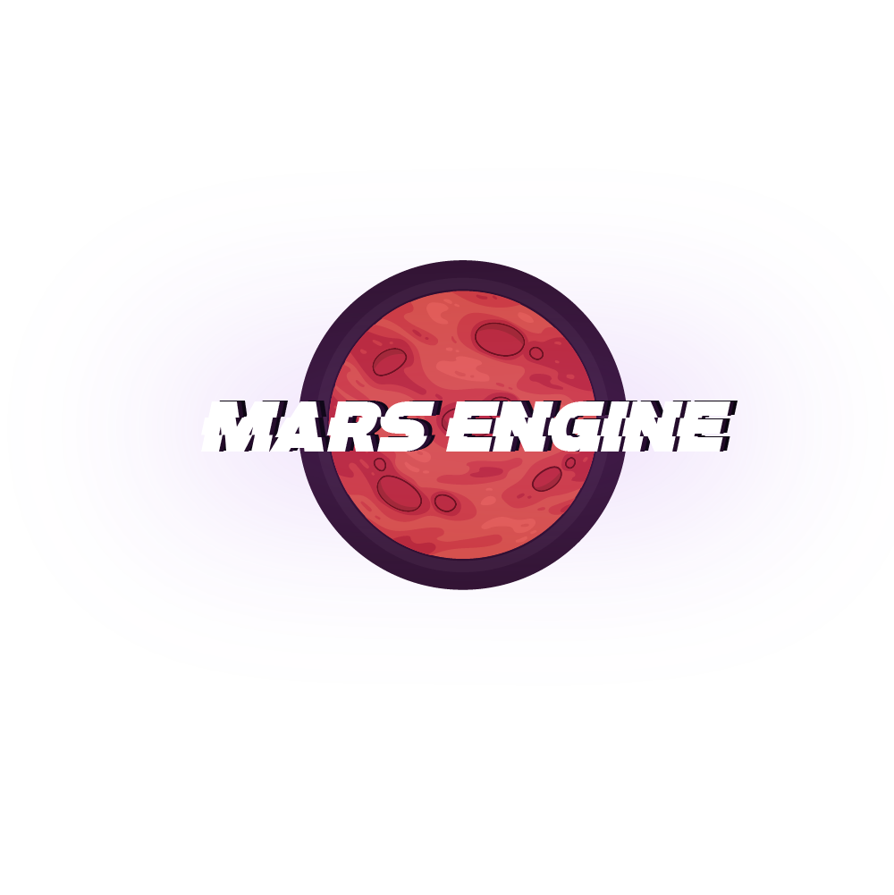

<p align="center">

</p>

# Welcome to MarsEngine

  MarsEngine is Real-Time 3D Creative Engine. MarsEngine focuses over High Stablity and Portablility. Also MarsEngine targets toward very Low Memeory usage. For now MarEngine is a early build, only libraries are available.
  
  * <a href="https://github.com/VikramSGIT/MarsEngine/wiki">Getting Started</a>
  * <a href="">Documentation</a>
  * <a href="">Road-Map and TODO List</a>

# Making a Game within A Minute

  MarsEngine has well built libraries capable of building a Game in minutes.
  
  ### Prerequisite ###
  
  * Visual Studios 2019 ( or <a href="https://github.com/VikramSGIT/MarsEngine/releases/download/1.0.0/NoVisualStudios.rar">using any other code editor?</a>. Extract this into working directory once created)
  
  ### Step 1: ###
  
  * Make a directory where game needs to be build.
  * Clone/download <a href="https://github.com/VikramSGIT/MarsEngine/archive/easy_game.zip">MarsEngine easy_game</a> branch.
  * Extract this <a href="https://github.com/VikramSGIT/MarsEngine/releases/download/untagged-95ec134c402a8e683c2b/Application.rar">zip</a> file into the directory.
  
  ### Step 2: ###
  
  * Open `Application.cpp` file in Visual Studios ( or <a href="https://github.com/VikramSGIT/MarsEngine/releases/download/1.0.0/NoVisualStudios.rar">using any other code editor?</a>).
  * Paste this code into `Paste Code Here!!` inside `Application.cpp`.
  ```c++
    Ref<ME::Mesh> Logo = ME::GenRect("Vikram", glm::vec2(590.0f, 310.0f), glm::vec2(690.0f, 410.0f));
	Logo->Scale( {3.4f, 2.0f, 1.0f} );
	Logo->SetReset(Logo->GetVertices());
	ME::MeshQueue Queue;
	Queue.PushMesh(Logo);

	Ref<ME::Renderer::Shader> shader = CreateRef<ME::Renderer::OpenGL::OpenGLShader>("MarsEngine\\MarsEngine\\res\\shaders\\Basic.shader");
	glm::mat4 MVP = glm::ortho(0.0f, 1280.0f, 0.0f, 720.0f);
	shader->SetUniformsMat4f("u_MVP", MVP);

	Ref<ME::Renderer::OpenGL::OpenGLTexture> texture = CreateRef<ME::Renderer::OpenGL::OpenGLTexture>("MarsEngine\\Branding\\MarsEngine\\MarsEngine.png");
	renderer->AddRenderSubmition(Queue, [&texture, &shader]()
	{
		texture->Bind();
		shader->SetUniforms1i("u_Texture", texture->GetSlot());
	});

	/// Editable///
	glm::vec3 gravity(0.0f, -9.8f, 0.0f);
	glm::vec3 forceX(5.0f, 0.0f, 0.0f);
	glm::vec3 forceY(0.0, 20.0f, 0.0f);
	float e = 0.8;
	///
	glm::vec3 speed(0.0f, 0.0f, 0.0f);

	ME::Utils::Time::timer timer;
	while(Running)
	{
		if(timer.TimeElapsed()[0] > ME::Utils::Time::milliseconds(10))
		{
			speed += gravity;
			if(window->IsKeyPressed(Event::Key::W))
				speed += forceY;
			if(window->IsKeyPressed(Event::Key::A))
				speed -= forceX;
			if(window->IsKeyPressed(Event::Key::S))
				speed -= forceY;
			if(window->IsKeyPressed(Event::Key::D))
				speed += forceX;
			
			Logo->Transulate(speed / glm::vec3(10.0f, 10.0f, 1.0f));
			timer.Reset();
		}

		for(ME::VERTEX vertex : Logo->GetVertices())
		{
			if(vertex.vertices[0] <= 0.0f)
			{
				speed.x = std::abs(speed.x) * e;
				Logo->Transulate({-vertex.vertices[0], 0.0f, 0.0f});
			}
			else if(vertex.vertices[0] >= 1280.0f)
			{
				speed.x = -std::abs(speed.x) * e;
				Logo->Transulate({1280.0f -vertex.vertices[0], 0.0f, 0.0f});
			}
			if(vertex.vertices[1] <= 0.0f)
			{
				speed.y = std::abs(speed.y) * e;
				Logo->Transulate({0.0f, -vertex.vertices[1], 0.0f});
			}
			else if(vertex.vertices[1] >= 720.0f)
			{
				speed.y = -std::abs(speed.y) * e;
				Logo->Transulate({0.0f, 720.0f -vertex.vertices[1], 0.0f});
			}
		}
		if (glfwWindowShouldClose(window->GetNativeWindow()))
			Running = false;

		renderer->Draw(shader);
		window->OnUpdate();
		renderer->OnUpdate();
	}
  ```
  * Now run `TheGame.bat` on your working directory.
  * Feel the Magic!!

> This guide will soon be updated with the things you can play within to make the game much cooler.
