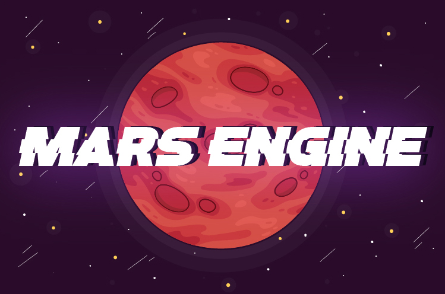
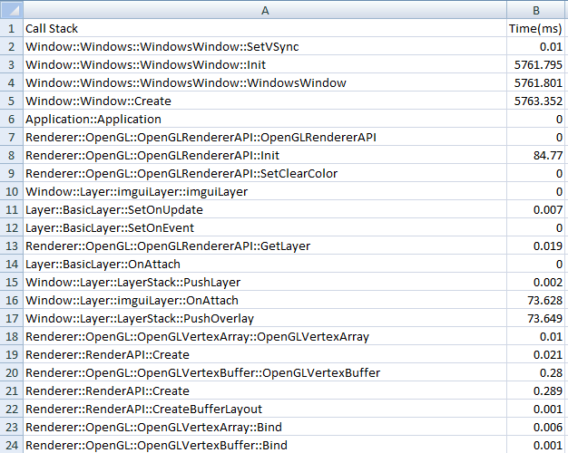

# MarsEngine

This is a project for 3D engine named MarsEngine

Download Build File: https://github.com/VikramSGIT/MarsEngine/releases

Download Source    : https://github.com/VikramSGIT/MarsEngine

STEPS TO GENERATE PROJECT FILES (For now supports only window!!):
1. Run Win-GenProjects.bat file
# ScreenShot
This is the output for the call profile of MarsEngine, made debug easier.

